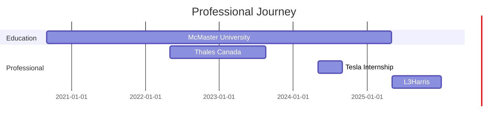

# Hi there! 👋 I'm Grigor Pahlevanyan

<div align="center">
  
  [](https://git.io/typing-svg)
  
  [](https://grigor-pahlevanyan.github.io/)
  [](https://www.linkedin.com/in/grigorpahlevanyan/)
  [](https://github.com/Grigor-Pahlevanyan/Resume_latex/blob/main/Grigor's%20Resume/main.pdf)
  
</div>

---

## 🚀 About Me

I'm a passionate **Mechatronics Engineer** and **Electrical Designer** currently working at **L3Harris**, with hands-on experience at industry giants like **Tesla** and **Thales Canada**. I thrive at the intersection of hardware and software, specializing in power electronics, embedded systems, and leading high-performing engineering teams.

### 🎯 **Current Focus**
- 🔋 **Power Electronics** & Battery Management Systems
- 🤖 **Robotics Engineering** & Autonomous Systems  
- 🧠 **Machine Learning** Applications in Engineering
- ⚡ **Embedded Systems** & Real-time Control
- 👥 **Technical Leadership** & Cross-functional Team Management

### 💼 **Professional Journey**
```
🏢 L3Harris                → Electrical Designer (2025 - Present)
🚗 Tesla                   → Power Electronics TPM Intern (2024)
🛡️ Thales Canada           → Component Engineering Intern (2022-2023)
🎓 McMaster University     → Mechatronics Engineering & CO-OP
```

---

## 🛠️ Tech Stack & Expertise

<div align="center">

### **Programming Languages**


### **Engineering Tools**


### **Technologies & Frameworks**


</div>

---

## 🏆 Key Achievements & Leadership

<table>
<tr>
<td width="50%">

### 🌞 **McMaster Solar Car Project**
**Electrical Engineering Manager** *(2021-2024)*
- 👥 Led **40+ engineering members** across 7 specialized teams
- ⚡ Designed complete **high-voltage electrical architecture**
- 🔋 Developed advanced **power management systems**
- 🛡️ Implemented safety-critical **precharge circuits**

</td>
<td width="50%">

### 🔋 **Battery Workforce Challenge**
**BMS Hardware Lead** *(2024-2025)*
- 🎯 **Successfully completed** industry challenge
- 👨‍💼 Managed team of **8 engineers**
- 🔧 Developed innovative **battery management solutions**
- 🤝 Led **cross-functional collaboration**

</td>
</tr>
</table>

---

## 📊 GitHub Analytics

<div align="center">
  
  
  

</div>

---

## 🚀 Featured Projects

<div align="center">

[](https://www.behance.net/gallery/165815539/Smart-Safety-Seat)
[](https://www.behance.net/gallery/163723257/High-Voltage-Electrical-Architecture-%28Solar-Car%29)

</div>

### 🛡️ **Smart Safety Seat**
Revolutionary automotive safety system integrating **LiDAR technology** and **machine learning algorithms** for real-time monitoring and enhanced passenger protection.

### ⚡ **Power Management System**
Advanced power electronics design for high-voltage applications, featuring intelligent energy distribution and safety-critical control systems.

---

## 🎯 What I'm Working On

```python
class GrigorPahlevanyan:
    def __init__(self):
        self.current_role = "Electrical Designer @ L3Harris"
        self.education = "Mechatronics Engineering @ McMaster University"
        self.interests = ["Robotics", "AI/ML", "Power Electronics", "Embedded Systems"]
        self.current_projects = [
            "Advanced Battery Management Systems",
            "AI-Powered Meeting Assistant",
            "Autonomous Vehicle Electronics"
        ]
    
    def get_next_goals(self):
        return [
            "🤖 Advanced robotics and autonomous systems",
            "🧠 AI/ML applications in engineering",
            "⚡ Next-generation power electronics",
            "🌱 Sustainable energy solutions"
        ]
```

---

## 📈 Experience Timeline



---

## 🌟 Fun Facts & Interests

- 🤖 **Robotics Enthusiast**: Always exploring the latest in autonomous systems and AI
- 🔋 **Clean Energy Advocate**: Passionate about sustainable technology solutions
- 🏎️ **Formula Student**: Love the intersection of motorsports and engineering excellence
- 🌍 **Multilingual**: Fluent in English, Armenian, and Russian
- 📚 **Continuous Learner**: Always diving into new technologies and methodologies

---

## 📫 Let's Connect!

I'm always excited to discuss engineering challenges, collaborate on innovative projects, or chat about the future of technology!

<div align="center">

### **Professional Contact**
[](mailto:pahlevag@mcmaster.ca)
[](https://www.linkedin.com/in/grigorpahlevanyan/)

### **Portfolio & Work**
[](https://grigor-pahlevanyan.github.io/)
[](https://github.com/Grigor-Pahlevanyan/Resume_latex/blob/main/Grigor's%20Resume/main.pdf)

---

### 💡 *"Innovation happens at the intersection of curiosity and engineering excellence"*

**Thanks for visiting my profile! Feel free to explore my repositories and don't hesitate to reach out! 🚀**

</div>

<!--
Fun fact: This README is dynamically generated and regularly updated!
Grigor-Pahlevanyan/Grigor-Pahlevanyan is a ✨ special ✨ repository because its `README.md` (this file) appears on your GitHub profile.
-->
